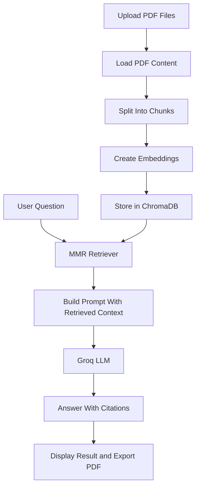

# MULTIPDF RAG AI ANALYZER

Live App: [Streamlit Demo](https://multipdf-rag-ai-analyzer-gg3maodxvcmannueasndaq.streamlit.app/)

A Streamlit-based Retrieval-Augmented Generation (RAG) application for analyzing one or more PDF documents with grounded answers, source citations, legal-mode prompting, and PDF export.

## Why This Project Matters

This project turns uploaded PDFs into a searchable knowledge base and answers user questions using retrieved document context instead of relying only on the language model's memory. It is designed to reduce hallucinations and make document analysis more explainable.

## Core Features

- Multi-PDF upload and analysis
- Retrieval-Augmented Generation (RAG) pipeline
- Chroma vector database for semantic search
- Hugging Face embeddings for chunk indexing
- Groq LLM inference for fast responses
- MMR retrieval for more diverse and relevant chunks
- General Q&A mode and Legal Analysis mode
- Page-level source citations
- Debug mode to inspect retrieved chunks
- Chat history stored in Streamlit session state
- Export generated answers as PDF

## Tech Stack

- Python
- Streamlit
- LangChain
- ChromaDB
- Hugging Face Embeddings
- Groq API
- PyPDFLoader
- ReportLab

## Architecture



## How It Works

1. Users upload one or more PDF documents.
2. The app extracts text using `PyPDFLoader`.
3. Documents are split into chunks with overlap for better context retention.
4. Each chunk is embedded using `all-MiniLM-L6-v2`.
5. Embeddings are stored in ChromaDB.
6. When the user asks a question, the app retrieves relevant chunks using MMR.
7. The retrieved context is passed to the Groq-hosted LLM.
8. The app returns an answer, citations, response time, and optional debug context.

## Key Engineering Decisions

### Why RAG instead of fine-tuning?
RAG is better for frequently changing document content because new PDFs can be indexed immediately without retraining a model.

### Why MMR retrieval?
MMR helps reduce repeated chunks from the same document and improves coverage when multiple PDFs are uploaded.

### Why session state?
The UI originally lost answers on Streamlit reruns triggered by buttons. This was fixed by storing query state, answer state, citations, and export data inside `st.session_state`.

## Challenges Solved

- Improved multi-document retrieval quality by using MMR
- Reduced hallucinations by grounding answers in retrieved chunks
- Fixed Streamlit rerun issues that cleared answers after UI interactions
- Added explainability with citations and debug chunk inspection
- Added PDF export for generated answers

## Project Structure

- `app.py` - main Streamlit application
- `requirements.txt` - Python dependencies
- `README.md` - project documentation
- `db/` - local Chroma persistence directory

## Setup

### 1. Clone the repository

```bash
git clone https://github.com/amirthaakarthika-star/MULTIPDF-RAG-AI-ANALYZER.git
cd MULTIPDF-RAG-AI-ANALYZER
```

### 2. Install dependencies

```bash
pip install -r requirements.txt
```

### 3. Configure environment variables
Create a `.env` file in the project root:

```env
GROQ_API_KEY=your_groq_api_key_here
```

### 4. Run the app

```bash
streamlit run app.py
```


## Limitations

- Works only with text-extractable PDFs
- Very large documents may increase indexing time
- Answer quality depends on chunking quality and retrieval quality
- The app currently uses a local vector store instead of a hosted production database

## Future Improvements

- Add streaming responses
- Add support for DOCX and TXT files
- Add deployment configuration for Streamlit Cloud or Hugging Face Spaces
- Add automated evaluation with sample question-answer benchmarks
- Add per-document filtering in the UI

## Recruiter Notes

This project demonstrates practical junior-level Generative AI engineering skills:

- building a complete RAG application end to end
- integrating embeddings, retrieval, vector storage, and LLM inference
- designing a usable UI for AI workflows
- debugging state-management issues in Streamlit
- presenting answers with traceable sources

## License

This project is for educational and portfolio use.
