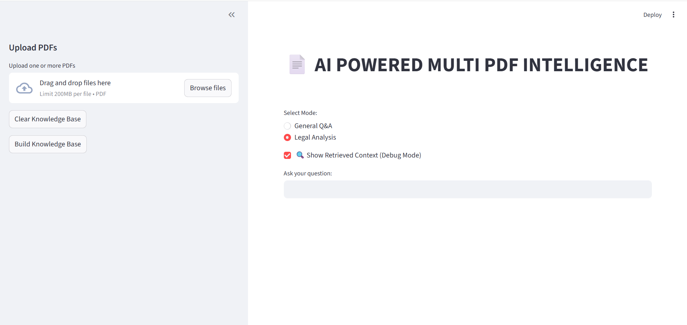
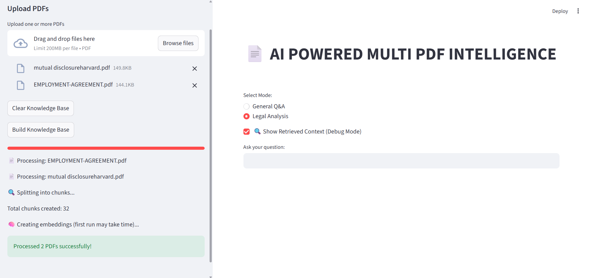

# 📄 AI Legal Document Assistant using RAG

## 🚀 Overview
This project is an AI-powered multi-document assistant that analyzes PDFs using Retrieval-Augmented Generation (RAG). It supports legal document analysis, comparison, and explainable AI outputs.
Implemented semantic search using embeddings and vector DB (Chroma)
Added chat history tracking and PDF export functionality
Integrated LLM (Groq) for context-aware responses

---

## 🔥 Features
- 📄 Multi-PDF upload and analysis
- ⚖️ Legal Analysis Mode (obligations, risks, clauses)
- 🔍 Multi-document comparison
- 📚 Page-level citations
- 🧠 Explainable AI (debug view showing retrieved chunks)
- ⚡ MMR-based retrieval for better relevance
- 🛠️ Error handling and robust processing

- Retrieval-Augmented Generation (RAG)
- Legal document analysis mode
- Debug mode with source tracing
- Chat history (session-based)
- Export answers as PDF

- 🤖 Ask questions across all PDF
- 🧠 Chat history tracking
- 📄 Download answers as PDF
- 🔍 Source citation with page numbers
- ⚡ Fast semantic search using embeddings
   
---

## 🧠 Tech Stack
- Python
- Streamlit
- LangChain
- ChromaDB
- HuggingFace Embeddings
- Groq API (LLM)
- pypdf
- reportlab(pdf export)

---

## 🖥️ How to Run

```bash
git clone https://github.com/amirthaakarthika-star/MULTICLOUD-RAG-AI-PDF-INTELLIGENCE.git
cd MULTICLOUD-RAG-AI-PDF-INTELLIGENCE
pip install -r requirements.txt
## 📸 Screenshots

### 🖥️ UI


### ⚙️ Processing Documents


### 🧠 AI Answer Output


### 🔍 Debug View (Explainable AI)


### 🧠 Chat History


### 📄 PDF Download


---

